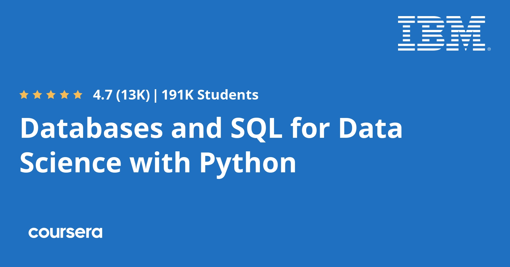

### Databases-and-SQL-for-Data-Science-with-Python (Honors)

 
course link : (https://www.coursera.org/learn/sql-data-science?specialization=ibm-data-science)

 
 
This repository contains the <b>answers</b> for coursera 's updated <b>"Databases and SQL for Data Science with Python " </b>course by ibm including the honors assignment .

<b>week 1 :</b> Getting started with Sql
<b>week 2 :</b> Introduction to relational Databases and  Tables
<b>week 3 : </b>intermediate Sql
<b>week 4 :</b> Accessing databases with Python
<b>week 5 :</b> Course Assignment
<b>week 6 :</b> Bonus Module : Advance Sql for DataEngineers (Honors)

This course can be applied to multiple Specializations or Professional Certificates programs. Completing this course will count towards your learning in any of the following programs:
<ul>
<b>Data Engineering Foundations Specialization
<li>IBM Data Analyst Professional Certificate
<li>IData Science Fundamentals with Python and SQL Specialization
<li>IIBM Data Engineering Professional Certificate
<li>IIntroduction to Data Science Specialization (Enrolled)
<li>IIBM Data Science Professional Certificate (Enrolled)

- 

